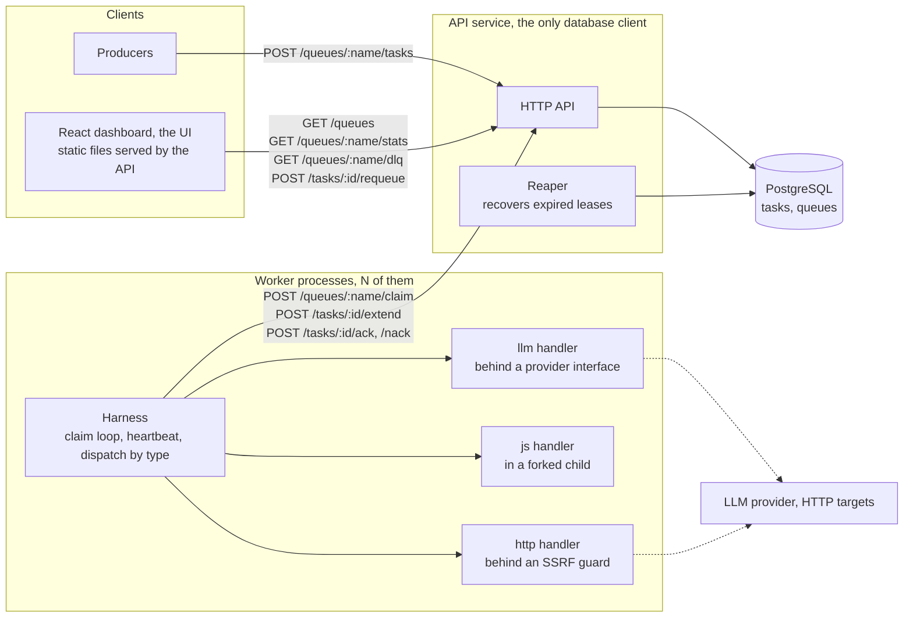

# Aguru Task Queue

A task queue built directly on PostgreSQL, no queue library — building the primitives is the
exercise. Producers enqueue typed tasks (`llm`, `js`, `http`) over an HTTP API; workers claim them in
batches under a lease, dispatch by type, and ack or nack. Failures retry with per-queue backoff;
terminal failures and exhausted retries land in a dead-letter queue with a replay path.



Only the API service touches the database. Workers are ordinary HTTP clients of it, so any number can
run against the same queue, and the dashboard is static files the API serves.

## Run it

Node 22.14+ and Docker Compose. If port 5432 is taken, `cp .env.example .env` moves Postgres to 5433; set
`PORT` if 3000 is.

```bash
npm start
```

One command: installs dependencies, builds the UI, starts Postgres, applies migrations, and runs the
API (port 3000) with one worker on the `jobs` queue. The dashboard is served at http://localhost:3000.

The worker endpoints (`claim`/`ack`/`nack`/`extend`) require an `X-Worker-Id` header — a caller
identity, not authentication (the service assumes a private network). Producers and reads need none.
A quick check:

```bash
curl -s -X POST localhost:3000/queues/jobs/tasks -H 'content-type: application/json' \
  -d '{"type":"js","payload":{"source":"return input.a + input.b;","input":{"a":2,"b":3}}}'
curl -s localhost:3000/tasks/<id>            # "result": 5, once the worker has run it
```

To drive the worker protocol by hand, use a queue the running worker does not poll, otherwise it
claims the task first. Ack takes an optional `result`; nack takes a `reason` and an optional
`retryable`, which defaults to true.

```bash
curl -s -X POST localhost:3000/queues/demo/tasks -H 'content-type: application/json' \
  -d '{"type":"js","payload":{"source":"return 1;"}}'
curl -s -X POST localhost:3000/queues/demo/claim -H 'content-type: application/json' \
  -H 'x-worker-id: me' -d '{"workerId":"me","max":1}'
curl -s -X POST localhost:3000/tasks/<id>/ack -H 'content-type: application/json' \
  -H 'x-worker-id: me' -d '{"result":1}'
```

A Postman collection covering every endpoint is in `docs/task-queue.postman_collection.json`.

## Run the tests

```bash
docker compose up -d --wait && npm test
```

Vitest, unit through end-to-end. Anything touching storage runs against real Postgres, each
test on its own database cloned from a migrated template. The required `concurrent-claim.test.ts` runs
alone:

```bash
npx vitest run test/concurrent-claim.test.ts
```

The UI's component tests run with `npm run ui:test`. CI runs both suites, both typechecks, and the UI
build on every push.

## What's implemented

### Per the brief

- The eight listed endpoints, and the harness on top of them: register a handler per type, claim in
  batches, dispatch by `task.type`, ack or nack, heartbeat, retry with per-queue backoff up to a
  configurable max attempts, DLQ on exhaustion.
- Three handlers. `llm` behind a stubbed provider interface with a real call path and real error
  handling; `js` executes the supplied script and captures its return value; `http` makes the
  described request and captures status and body.
- Queue mechanics: atomic batch claim (`FOR UPDATE SKIP LOCKED`), leases renewed by heartbeat, a reaper
  that recovers expired leases, per-type retryability, a paginated DLQ with a requeue that resets the
  attempt count, `dedupeKey` windows.
- The React page: queue counts refreshing live, drill-in to the DLQ, per-row requeue. Served as static
  files by the API.

### Additional

- `GET /tasks/:id`, and `ack` carrying `{ result }`. The brief requires results to be retrievable
  after ack, but no listed endpoint returns one.
- `retryable` on `nack`. As listed, the server sees only a reason string and can only count attempts,
  so the per-type retryability line the brief asks for would be invisible in behaviour.
- A per-claim `claimId` fence on `ack`/`nack`/`extend`. Matching `workerId` alone lets a stale
  execution act on a task the same worker has since re-claimed. Optional, so the listed shapes work.
- `js` runs in a forked child with a scrubbed environment, capped heap and hard timeout, never in the
  worker's process. The script is untrusted input; in-process it would inherit the worker's memory,
  environment and credentials.
- An SSRF guard on `http`: denied ranges checked against the resolved IP, that IP pinned for the
  connection, re-validated on every redirect, response size and time capped. The payload names an
  arbitrary URL, so without this the queue is an open proxy into the private network.
- An execution budget per task, enforced by the harness and by `extend`. Without a ceiling a handler
  that keeps heartbeating holds its task forever, indistinguishable from progress.
- Graceful shutdown drains in-flight work and hands it back without counting an attempt. A deploy
  restart is not the task's fault; charging it would push tasks towards the DLQ on every rollout.

## What isn't

Not built, in the order it would be built next:

- **Retention.** Nothing bounds succeeded rows. With it, `fillfactor` and autovacuum tuning on `tasks`,
  since page-full heaps undermine the HOT-update argument the heartbeat path relies on.
- **`LISTEN/NOTIFY`.** The UI polls `stats` and idle workers poll `claim`; one notification channel
  would replace both.
- **Observability** beyond `stats` and `/healthz`: age of the oldest ready task, DLQ arrival rate,
  reaper-tick staleness, pool wait.
- **Backpressure.** Nothing bounds enqueue except the disk; a per-queue depth cap answered with `429`
  and `Retry-After` would.
- **Batch `extend`.** The per-task endpoint costs one round trip per held task per heartbeat.
- **OS-level sandboxing for `js`.** The forked child is a process boundary, not a security one: it
  retains filesystem and network access. Real containment needs a container, jail or seccomp profile.
  This is the stated residual risk of the `js` handler.
- **Per-worker credentials.** `X-Worker-Id` identifies a caller; it does not authenticate one.

## Why exactly-once is off the table

The side effect and the ack are two writes to two systems with no transaction across them. A worker
that dies between them leaves the same row as one that died before starting: `in_flight`, lease
lapsed. On expiry the reaper either drops or redelivers. It redelivers. At-least-once is the guarantee
that can be kept; a duplicate is observable, a drop is not.

Exactly-once *effects* are the consumer's job. Handlers get a stable `task.id` to use as an idempotency
key. On the queue side the claim-id fence rejects a stale ack, so a repeat can duplicate the effect but
never double-complete the row.
